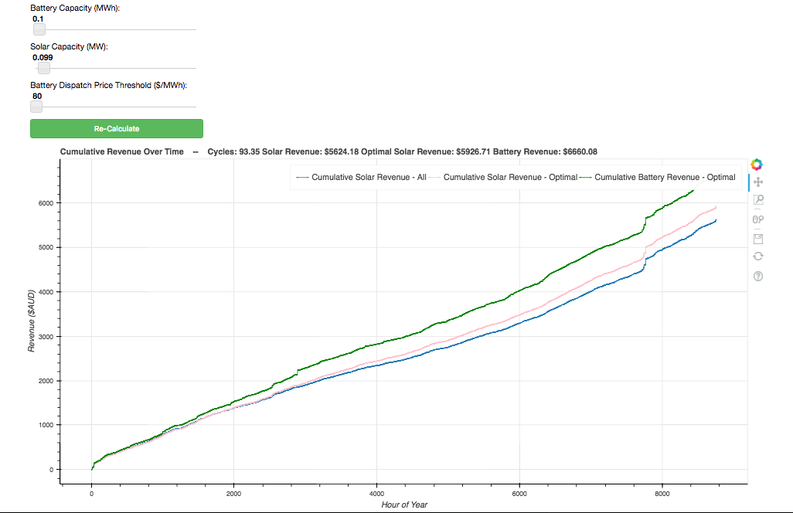

# Byron Battery Model
### Solar & Battery System Simulation

This program simulates the operation of a solar + battery system on the NEM. At the moment, it uses solar data from pvoutput.org (normalised, aggregated) and electricity spot market price data from AEMO.

You will need python and bokeh to run this model. In terminal, you can install bokeh with 'pip install bokeh'.

To run the live server, use the runSimulation.sh bash script (ie. 'bash runSimulation.sh). If all is well, a browser window will open up with the interactive tool.

This tool is open source and released under the [MIT License ](https://en.wikipedia.org/wiki/MIT_License)

By Luke Marshall and Naomi Stringer